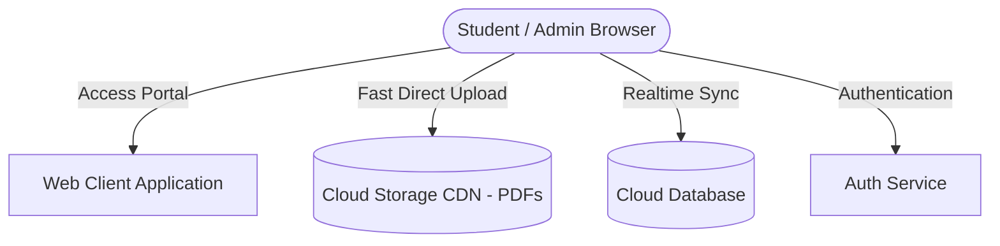

# 🎓 Management Hub — IIT Madras BS Management & Analytics Portal

[](LICENSE)
[](https://firebase.google.com)
[](https://cloudinary.com)

**Management Hub** is a fast, modern, and comprehensive academic resource platform designed specifically for students of the **IIT Madras BS in Management and Data Science / Business Analytics** program.

It provides centralized, 24/7 access to curated course catalogs, multi-contributor study notes, past year examination question papers (PYQs), dynamic grading calculators, search analytics, and administrative management tools.

---

## ✨ Key Features

### 📚 Academic Catalog & Study Resources
- **Full Curriculum Catalog:** Covers 52+ courses across Foundation, Diploma (Management & Analytics), and BS Degree tiers.
- **📁 Multi-Section / Contributor Notes:** Group study notes by author (e.g. *Ashu's Notes*, *Sibu's Notes*, *Lecture Slides*, *Handwritten Notes*, *Formula Sheets*).
- **📝 Previous Year Questions (PYQs):** Year-wise past exam question papers with one-click direct PDF preview and downloads.
- **⚡ Instant 0ms Load Time:** Smart in-memory client caching with asynchronous background Cloud Firestore synchronization.
- **🔍 Real-Time Intelligent Search:** Fast fuzzy search across course codes (`BSMS1201`), titles, levels, and prerequisites.

### 🧮 Student Productivity Tools
- **End-Term Passing Calculator:** Interactive grading calculator to compute exact required end-term scores based on assignments and quiz marks.
- **🔖 Local Bookmarks:** One-click course bookmarking saved to browser storage for offline quick reference.
- **🔗 Official Ecosystem Links:** Curated shortcuts to student portals, discussion forums, and academic resources.

### 👑 Resource Management & Admin Tools
- **Secure Access Control:** Encrypted authentication for course management.
- **High-Speed Cloud Storage:** Direct signed uploads to cloud CDN (supporting 1,000+ PDFs seamlessly).
- **Multi-Resource Modal:** Attach, preview (`Open ↗`), and manage individual notes and PYQ papers per course.
- **Catalog Management:** Real-time synchronization and master catalog backup.

---

## 🏗️ Architecture & Tech Stack



| Layer | Technology |
|---|---|
| **Frontend** | Vanilla HTML5, CSS3 (Modern Glassmorphism & Custom Properties), JavaScript (ES6+) |
| **Database** | Cloud Firestore (Real-time NoSQL cloud sync) |
| **Authentication** | Firebase Authentication (OAuth & Email/Password) |
| **PDF & Asset Storage** | Cloudinary REST API & Global CDN |
| **Local Development** | Node.js, Express.js (Optional Local Server) |

---

## 📂 Project Structure

```
Management-Hub/
├── index.html            # Main Student Portal & Interactive Course Catalog
├── course.html           # Dedicated Course Details Page (Multi-Section Folders & PYQs)
├── inmycontrol.html      # Administrator Dashboard & Resource Manager
├── login.html            # User Login Gateway
├── register.html         # User Registration Page
├── profile.html          # Student Profile & Saved Bookmarks
├── script.js             # Main Portal Application Logic & Instant Caching
├── style.css             # Unified Design System, Cards & Typography
├── firebase-config.js    # Cloud Integration & Client SDK Configuration
├── server.js             # Node.js Express Backend (for Local Development)
├── package.json          # Project Dependencies & Build Scripts
└── data/
    └── courses.json      # Master Fallback Course Catalog (52 Courses)
```

---

## 🛠️ Getting Started (Local Development)

### 1. Clone the Repository
```bash
git clone https://github.com/ashusingh06/Management-Hub.git
cd Management-Hub
```

### 2. Install Dependencies
```bash
npm install
```

### 3. Run Application
```bash
npm start
```
Open your browser at `http://localhost:3000`.

---

## 👥 Contributors & Community

- **Aashish Singh (Ashu)** — Creator & Lead Maintainer ([@ashusingh06](https://github.com/ashusingh06))
- **Sibu** — Core Academic Contributor

---

## 📄 License

This project is licensed under the MIT License - see the [LICENSE](LICENSE) file for details.
